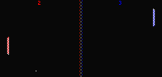

# TMS-101

A fantasy console inspired by [PICO-8](https://www.lexaloffle.com/pico-8.php), [box-256](http://box-256.com/), and [EXAPUNKS](https://www.zachtronics.com/exapunks/)

This project prioritizes interesting, hacky ways to make games over easy and straightforward ones. If you aren't into that and just want a simple way to make neat retro-style games, there's no shame in that; I'd suggest [PICO-8](https://www.lexaloffle.com/pico-8.php) or [raylib](https://www.raylib.com/index.html), depending on what you want to make.




## Getting started

This project uses [Odin](https://odin-lang.org/), so that needs to be installed (such as through `asdf`). It also uses raylib, which comes packaged with Odin so it likely won't need installing.

To try out one of the demos (pong in this example) use the following command:

```sh
odin run tms -- examples/pong
```

It is also recomended to look at the tms-assembly files for the examples to understand what is going on (`examples/starslide/starslide.tmsasm` is a good place to start).
